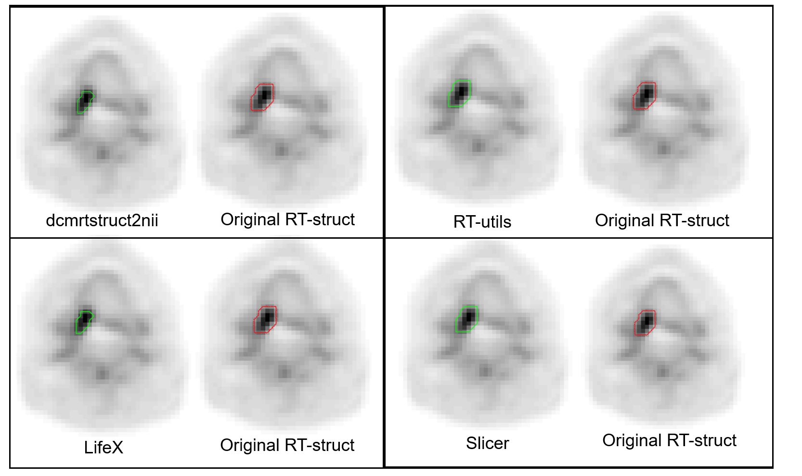

# Summary

In the pursuit of automated and precise analysis of medical images using artificial intelligence, we introduce RT-utils, a specialized Python library designed to simplify the handling of radiotherapy imaging data. Medical images are commonly stored in the DICOM standard (Digital Imaging and Communications in Medicine), which is the universal format for sharing medical imaging information. In radiotherapy, the region of interests (ROIs) around the critical structures like tumors and surrounding organs are represented as detailed contours within DICOM files, specifically in what is known as the RTSTRUCT files (Radiotherapy Structure). RT-utils excels at converting these complex polygonal contours into straightforward binary masks. These masks are essentially grids where each point indicates the presence or absence of a structure, making them ideal for computational processing. By transforming DICOM radiotherapy structures into standardized data formats like NumPy arrays and SimpleITK images, RT-utils streamline the input for AI-based segmentation techniques and radiomics analysis, which are methods used to extract quantitative features from medical images. Since its inception in 2020, RT-utils has been widely adopted to simplify complex data processing tasks in medical imaging. It offers researchers and developers a powerful tool to enhance their workflows, ultimately driving significant advancements in medical image analysis and contributing to improved patient care.

# Statement of need

The increasing adoption of AI-based methods for medical image analysis necessitates efficient tools for handling DICOM images and RT-Structures. While existing software packages provide basic functionalities for data conversion, they often lack the advanced features required for seamless integration into clinical workflows. The growing need for automated and robust analysis of medical images has driven the adoption of AI-based methods that often use DICOM images and RT structures as masks. However, the effectiveness of these AI approaches can vary due to differences in data sources and conversion techniques [@Whybra2023-en; @Yousefirizi2023-ax; @Rufenacht2023-as]. Despite the availability of tools for converting DICOM images and RT-Structures into other formats [@Anderson2021-fp; @Rufenacht2023-as], integrating auto-segmentation solutions using deep learning in clinical environments is rare due to the lack of open-source frameworks that handle DICOM RT-Structure sets precisely. Software packages like dcmrtstruct2nii, DicomRTTool [@Anderson2021-fp], and PyRaDiSe [@Rufenacht2023-as] provide necessary functionalities with higher accuracy, while frameworks like TorchIO [@Perez-Garcia2021-jf] and MONAI [@Creators_The_MONAI_Consortium_undated-or] face limitations in processing DICOM RT-structure data. Research has shown that variations in mask-generation methods affect patient clustering and radiomic-based modeling in multi-center studies [@Whybra2023-en]. RT-utils is an standard Python library that enhances the efficiency of manipulating RT-Structures. It is designed for researchers and clinicians who require advanced yet user-friendly tools to: i) Convert and manipulate RT-Struct data with precision. ii) Integrate AI-generated segmentation masks into clinical DICOM formats. iii) Streamline workflows by automating repetitive and complex tasks. iv) Ensure compatibility with clinical systems through meticulous DICOM header management. By providing these capabilities, RT-utils optimizes workflows in medical imaging analysis, facilitating the translation of AI models from research to clinical practice. RT-utils offers advanced techniques to convert expert-provided contours and AI tool output masks to RT-struct format, making them suitable for clinical workflows.

# Overview of RT-utils

Our library introduces intuitive techniques for efficient data curation of RT-Structure files, facilitating the identification of distinct region of interest (ROI) names and their corresponding locations within the structures. It adeptly handles scenarios where multiple ROI names correspond to the same structure, ensuring a comprehensive and accurate representation. Additionally, the library offers the conversion of DICOM images and RT-Struct into widely used formats such as NumPy arrays and SimpleITK Images. These standardized formats serve as optimal inputs for various applications, including deep learning models, image analysis, and radiomic feature calculations (extraction). Moreover, the toolkit simplifies the process of creating DICOM RT-Struct from predicted NumPy arrays, commonly the outputs of semantic segmentation deep learning models, providing a versatile solution for researchers and practitioners in medical imaging.
In the realm of data science, discretized image formats such as NIfTI, NRRD, and MHA are commonly employed, while radiotherapy workflows heavily rely on the DICOM format, specifically the DICOM RT-Struct. Unlike data science architectures like U-Net, which operate on grid-based data, handling the continuously spaced contour points present in RT-Struct poses a unique challenge. To bridge this gap, accurate data conversion between discrete and continuous spaces becomes crucial when working with clinical DICOM RT-Struct data.

## Technical Overview 

**RT-utils** streamlines RT-Structure file curation by identifying Regions of Interest (ROIs), handling multiple ROI names for the same structure, and converting DICOM RT-Struct and images into formats like NumPy arrays and SimpleITK images. These standardized outputs enable deep learning, image analysis, and radiomics applications. The toolkit also generates DICOM RT-Struct files from predicted arrays, bridging segmentation models and clinical workflows.

The library addresses challenges in converting between discretized image formats (e.g., NIfTI, MHA) and RT-Struct's contour-based format, leveraging geometric operations for accurate binary masks from contour points.

## Key Features

- **ROI Handling:** Identify and manage ROIs, including scenarios where multiple names map to one structure.
- **DICOM Conversion:** Convert RT-Struct and DICOM images to NumPy arrays and SimpleITK images, optimizing inputs for AI and radiomics.
- **RT-Struct Generation:** Create RT-Struct files from segmentation model outputs, ensuring compatibility with clinical formats.
- **Geometric Operations:** Use the Shapely library for accurate binary mask creation from DICOM contours.

## Functional Capabilities

- **ROI Creation and Retrieval:** Define ROIs using binary masks, specify attributes (e.g., name, color), list ROIs, and extract masks.
- **DICOM Header Management:** Transfer essential headers while ensuring RT-Struct validity and dynamic ROI integration.
- **Mask Integration:** Add ROIs as 3D binary arrays, aligned with DICOM slice locations.
- **Advanced Options:** Features like the `use_pin_hole` parameter eliminate nested contours for compatibility with specific viewers.

## Applications and Limitations

RT-utils accelerates deep learning model development and facilitates clinical workflow integration, enhancing radiomics and image analysis. While its 2D-based contour conversion may produce pixelated outputs, future updates aim to improve clinical acceptance.

# Real-world Example
For comparing the effects of different RT-Struct conversion methods, we investigated the RT-utils tool, dcmrtstruct2nii (https://github.com/Sikerdebaard/dcmrtstruct2nii) and the built-in tools from LIFEx[@Nioche2018-ct] and 3D Slicer [@Fedorov2012-ax]. We implemented the conversion technique and conducted a comparison of the NIfTI ground truth files. The level of agreement observed between RT-utils and LIFEx surpasses that of other techniques. The mean absolute errors with respect to RT-utils are shown on sagittal and coronal masks. (Figure 1). The visual inspection of an example of converted masks overlaid on PET scans using different techniques is shown in Figure 1. The PET scan used in this figure was sourced from the publicly available HECKTOR Challenge dataset. We presented a real-world example of ground truth conversion from RT-struct to masks, leveraging quantitative metrics such as mean absolute error and pixel count to ensure accuracy and precision in [@Yousefirizi2023-ax].

# Acknowledgements

The authors wish to acknowledge the Natural Sciences and Engineering Research Council of Canada (NSERC) Discovery Grants RGPIN-2019-06467 and RGPIN-2021-02965.

# References
