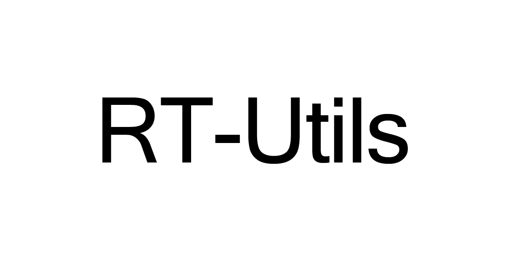
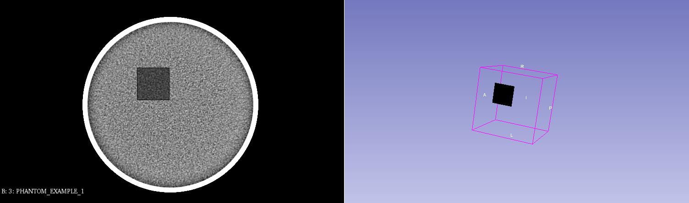

<p align="center">
  
</p>
<p align="center">
  <sub>A minimal Python library for RTStruct manipulation</sub>
</p>
<p align="center">
    <a href="https://badge.fury.io/py/rt-utils"></a>  
</p>
 
---
 
Motivated to allow physicians and other users to view the results of ML segmentation, rt-utils allows you to create new RTStructs, easily add one or more regions of interest, and save the resulting RTStruct in just a few lines! There will also be support 

## How it works
RT-Utils provides a builder class to faciliate the creation or loading of an RTStruct. From there you can add ROIs through masks and optinally input the colour of the region along with the name.

The format for the ROI mask is an nd numpy array. We expect an array of 2d binary masks, one plane for each slice location within the DICOM series. The slices should be sorted in ascending order within the mask. Through these masks, we extract the contours of the regions of interest and place them within the RTStruct file. Note that there is currently only support for the use of one frame of reference UID and structered set ROI sequence. Also note that holes within the ROI may be handled poorly.

## Installation
```
pip install rt_utils
```

## Creating new RTStructs
```Python
from rt_utils import RTStructBuilder

rtstruct = RTStructBuilder.create_new(dicom_series_path="./testlocation")
rtstruct.add_roi(mask=MASK_FROM_ML_MODEL, color=[255, 0, 255], name="RT-Utils ROI!")
rtstruct.save("test-rt-struct.dcm")
```

## Loading existing RTStructs
```Python
from rt_utils import RTStructBuilder

rtstruct = RTStructBuilder.create_from(dicom_series_path="./testlocation", rt_struct_path="./testlocation/rt-struct.dcm")
rtstruct.add_roi(mask=MASK_FROM_ML_MODEL, color=[255, 0, 255], name="RT-Utils ROI!")
rtstruct.save("updated-rt-struct.dcm")
```
This is the main motivation of the project. Wanted to allow physicians to be able to view 

## Results
<p align="center">
  
</p>
<p align="center">
  The results of a generated ROI with a dummy mask, as viewed in Slicer.
</p>
